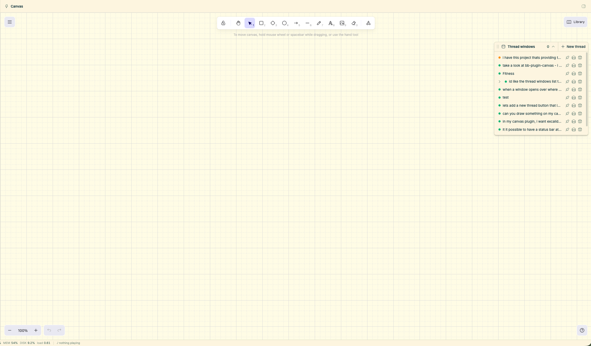

# bb-canvas

A freeform [Excalidraw](https://excalidraw.com) drawing surface with floating
thread windows on top, for [bb](https://getbb.app). Reach it from the **Canvas**
entry in the sidebar.

Sketch a plan, then keep several live threads open beside it — each window is
bb's real chat, and it moves where you put it.



## What it does

- **The real chat, not a copy.** Each window wraps bb's own `ThreadChat`, so you
  get the actual timeline — tool calls, diffs, file rows, queued messages,
  drafts — plus the real composer, attachments, @-mentions, and the thread's own
  permission mode.
- **Windows you place yourself.** Drag a window by its title bar, resize it from
  the corner. Windows stack in their own layer above the drawing, so the one you
  click comes forward without ever escaping above Excalidraw's own dialogs.
- **A thread list in the panel.** The **Thread windows** panel lists threads in
  bb's parent/child tree with per-row expand/collapse, and opens them as windows
  rather than navigating away. Each row offers pin, mark read/unread, and
  archive, and threads waiting on you are flagged. This panel is canvas-local —
  it does **not** replace bb's sidebar list (see below).
- **The drawing persists.** The scene is saved to the plugin's own storage, so a
  drawing survives reloads and app restarts. The grid setting is persisted too,
  because Excalidraw treats grid mode as a UI preference and would otherwise
  forget it.
- **Agents can draw.** The server exposes RPC so an agent can add to the canvas
  while you work in it (see [Agent RPC](#agent-rpc)).

## Install

```sh
bb plugin install https://github.com/RCopeland/bb-canvas.git
bb plugin reload canvas
```

`bb plugin install` takes a Git URL directly, so there is no need to clone
first. To work from a local checkout instead, point it at the directory:

```sh
bb plugin install /path/to/bb-canvas
```

Requires bb `>=0.44` and plugin SDK `>=0.5.29`.

### The package name keeps a prefix

The package is named `bb-plugin-canvas`, which is what sets the install and
reload id: `bb` strips the `bb-plugin-` prefix, so the id is `canvas`. That
prefix is mandatory — `bb`'s own scaffolder forces a name of the form
`bb-plugin-<id>` — so the package name cannot be shortened to `bb-canvas`. The
GitHub repo and the product name are `bb-canvas`; only the package name keeps
the prefix.

## It does not replace your sidebar

This plugin registers only its own Canvas entry. Your sidebar thread list stays
bb's own, always, with no setting to undo.

> Earlier versions registered into the exclusive `experimental_threadList` slot,
> which is a wholesale *replacement* that bb activates automatically — so simply
> enabling the plugin replaced the sidebar list everywhere in bb. That is
> removed. If you are on such a version, pin bb's list back with
> `bb settings ui set sidebar.threadListProvider thread-list/thread-list`, or
> update — the current version needs no setting.

The canvas panel keeps its own list instead. `canvas/SidebarThreadList.tsx`,
`ThreadListActionsMenu.tsx`, and `threadGrouping.ts` are retained but
unreferenced, as the path back to that behavior if it is ever wanted.

## Agent RPC

The server persists the scene over bb's RPC and marks the contract
`experimental_discoverable`, so agents can find these without being told about
them out of band:

| Method | Purpose |
| --- | --- |
| `canvas_load` | Read the stored scene, its revision, and current bounds/placement hints |
| `canvas_save` | Replace the scene, guarded by `baseRevision` |
| `canvas_draw` | **Additive** draw: merge elements in, remove nothing |
| `windows_load` | Read the saved floating-window layout |
| `windows_save` | Replace the floating-window layout |

`canvas_draw` is the method an agent should use — it merges into whatever is
already on the canvas rather than replacing it. Writes carry a `baseRevision`,
and a write based on a revision storage has moved past is rejected with
`StaleRevisionError` rather than overwriting newer work.

```sh
bb plugin rpc list canvas
```

See [PLUGIN_OVERVIEW.md](./PLUGIN_OVERVIEW.md) for the coordinate-frame design
and the known constraints (notably the large frontend bundle, a consequence of
Excalidraw being a full drawing application).

## Development

```sh
npm install
npm run vendor-excalidraw   # refresh canvas/vendor/excalidraw.css after upgrading excalidraw
npm run typecheck
npm test                    # 100 tests: sanitizer, scene merge, layering, grid,
                            # window layout, drag, thread tree, thread grouping
npm run build               # bb plugin build — the plugin-contract gate
bb plugin dev .             # watch, rebuild, and reload on change
```

### Storage

Two independent keys in the plugin's key/value store, deliberately separate:

| Key | Contents |
| --- | --- |
| `scene` | `{ scene, revision }` — the drawing. Revision-guarded, and the target of the agent's `canvas_draw` |
| `windows` | The floating-window layout. Plain array, **no revision** |

Keeping the layout out of the scene is load-bearing. The scene revision is how a
stale write is detected, so a dragged window must not bump it — otherwise moving
a window would look like a conflicting edit to an agent drawing at the same time.

### Layout

| Path | Purpose |
| --- | --- |
| `app.tsx` | `navPanel` registration: the sidebar entry and page route |
| `canvas/CanvasPage.tsx` | Excalidraw surface, floating layer, scene persistence |
| `canvas/ThreadLauncher.tsx` | Canvas **Thread windows** panel: opens floating windows instead of navigating |
| `canvas/ThreadRow.tsx` | The one thread row, used by the canvas panel |
| `canvas/threadTree.ts` | Pure parent/child grouping |
| `canvas/ThreadWindow.tsx` | Window chrome wrapping the host's `ThreadChat` |
| `canvas/useWindowDrag.ts` | Pointer drag, corner resize, and the launcher drag |
| `canvas/layering.ts` | Z-index ordering for the drawing, window, and panel layers |
| `canvas/windowLayout.ts` | Validates, clamps, and diffs the saved floating-window layout |
| `canvas/gridPreference.ts` | Grid default plus the persisted appState keys |
| `canvas/json.ts` | Sanitizes Excalidraw elements to strict JSON before saving |
| `canvas/types.ts` | Thread presence/status mapping and launcher row helpers |
| `canvas/scene.ts` | Server-side additive element merge and layout hints |
| `canvas/vendor/` | Vendored Excalidraw stylesheet |
| `server.ts` | Scene and window-layout persistence over RPC, with size guards |
| `canvas/SidebarThreadList.tsx` | Sidebar-style thread list: filter, grouping, sections. **Unreferenced** |
| `canvas/ThreadListActionsMenu.tsx` | Organize / Sort by / New section. **Unreferenced** |
| `canvas/threadGrouping.ts` | Pure pinned / section / project / machine bucketing. **Unreferenced** |
| `components/`, `lib/`, `hooks/` | Vendored shadcn source (yours to edit) |

### Tests

| Path | Covers |
| --- | --- |
| `test/json.test.ts` | Sanitizer edge cases: cycles, BigInt, NaN, array holes |
| `test/scene.test.ts` | Merge and placement behaviour |
| `test/layering.test.ts` | Layer ordering against Excalidraw's own z-indexes |
| `test/gridPreference.test.ts` | "Default only when never chosen" |
| `test/windowLayout.test.ts` | Layout validation, clamping, thread retention, change detection |
| `test/useWindowDrag.test.ts` | Drag and resize position arithmetic |
| `test/threadLauncher.test.ts` | Tree grouping, relative time, activity summaries |
| `test/threadGrouping.test.ts` | Pinned/section/project/machine bucketing, no duplication or loss |

## License

[MIT](./LICENSE)
